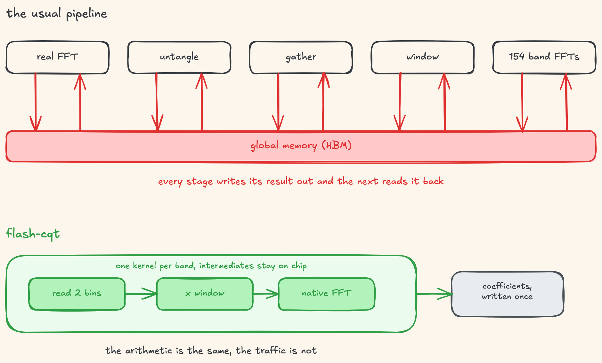
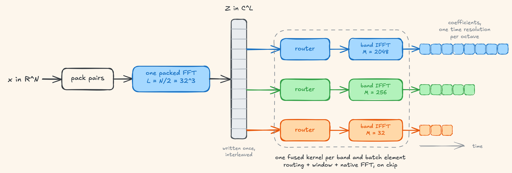
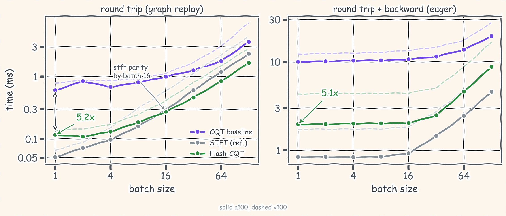

<div align="center">
  

# Flash-CQT

**A fast, exactly invertible and differentiable constant-Q transform in raw CUDA.**

[](https://arxiv.org/abs/2609.29119)
[](#)

</div>

The invertible CQT gives audio a log-frequency axis and reconstructs the waveform exactly. But every octave has its own transform length, and the usual GPU method of library calls spends most of its time moving intermediates through global memory.

<div align="center">
  
</div>

Flash-CQT works out an exact operator rearrangement. One packed FFT of half the length feeds a fixed routing table, which folds spectral recovery, selection and windowing into a single map, and each band then completes its own short FFT at its native length, fused with the routing in one kernel. No band is zero-padded and nothing is thus approximated. The same two engines run analysis, synthesis and both adjoints from different tables.

<div align="center">
  
</div>

## numbers

The baseline computes the identical transform through cuFFT-backed calls, with the same windows and the same native lengths, and every ratio pairs two measurements taken in the same run on the same card. The STFT appears as a lighter single-resolution reference with nearly the same number of coefficients.

<div align="center">
  
</div>

| method | multi-res | SNR (dB) | workspace (MB) | round trip (ms) | step (ms) |
|---|:-:|--:|--:|--:|--:|
| STFT (reference) | ✗ | 133.1 | 4.3 | 0.051 | 0.838 |
| CQT baseline | ✓ | 126.8 | 4.2 | 0.601 | 10.003 |
| **Flash-CQT** | ✓ | **129.8** | **2.6** | **0.116** | **1.969** |

*A100, batch 1, FP32. Round trips under CUDA graph replay, steps include eager backpropagation.*

Across batch sizes the round trip runs 2 to 8 times faster than the baseline on A100 and 2 to 6 on V100, and reaches STFT parity by batch 16. The differentiable round trip, that is analysis, synthesis, loss and backward, runs 2.2 to 5.3 times faster, with gradients agreeing with autograd at about 130 dB. Peak transient workspace is 36 to 38% smaller.

## use

```python
import torch
from flash_cqt import OctCQT

cqt = OctCQT([3, 4, 2], [8, 16, 32], fs=44100, audio_len=65536, device="cuda")
x = torch.randn(4, 65536, device="cuda")
blocks, side = cqt.fwd(x)   #ragged complex blocks, one time resolution per octave
y = cqt.bwd(blocks, side)   #reconstructs x at about 130 db
```

`OctCQT` is the reference, pure torch, and runs anywhere including mps. The CUDA kernels sit behind three wrappers and compile with `torch.utils.cpp_extension` on first use.

```python
from flash_cqt.fused import FusedOctCQT       #the fast path, graph replayable
from flash_cqt.trainable import TrainableCQT  #autograd through the adjoint kernels
from flash_cqt import SlicedCQT               #bounded state streaming, 50% overlap
```

The fast kernels are specialised to 65536-sample slices (1.49 s at 44.1 kHz, lowest band 43 Hz); longer signals stream through overlapping slices, shorter ones run on the reference path. Tested on V100, A100 and H200.

## citing

```bibtex
@article{franchino2026flashcqt,
  title={Exact Factorisation and Fast Computation of Invertible Constant-Q Transforms},
  author={Franchino, Facundo and Moliner, Eloi and V{\"a}lim{\"a}ki, Vesa},
  journal={arXiv preprint arXiv:2609.29119},
  year={2026}
}
```

## credits

The general kernel design philosophy owes a lot to [FlashFFTConv](https://github.com/HazyResearch/flash-fft-conv) and generally to the myriad of lessons (paper/blog/OS repos) from the folks at Hazy Research, Stanford University. The transform itself rests on the nonstationary Gabor frame work of Balazs, Velasco, Holighaus and colleagues, as well as Judy Brown. The sliced form follows [sliCQ](https://github.com/sevagh/xumx-sliCQ), and the octave layout matches [CQT_pytorch](https://github.com/eloimoliner/CQT_pytorch).
